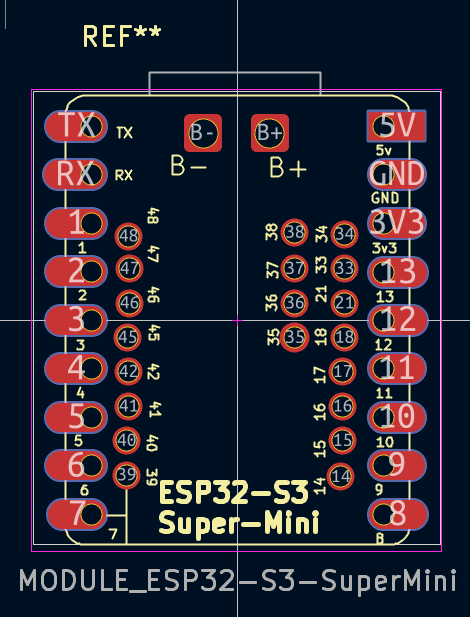
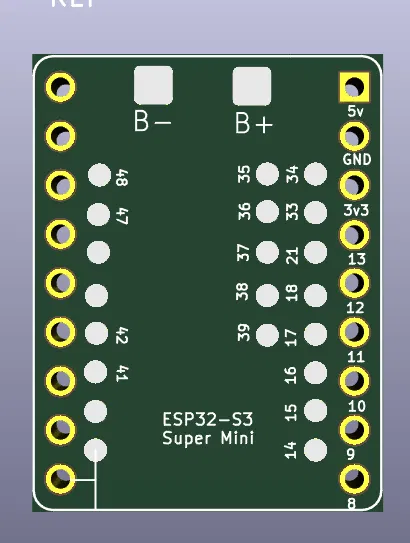

# ESP32-S3 Super Mini — KiCad Footprint

KiCad footprint for the **ESP32-S3 Super Mini** module (`MODULE_ESP32-S3-SuperMini`).

3D view:

## Pinout

| Left side | Right side |
|---|---|
| TX, RX, 1–7 (GPIO 48, 47, 46, 45, 42, 41, 40, 39) | 35, 36, 37, 38, 39, 34, 33, 21, 18, 17, 16, 15, 14 |

| Top | Right (power/misc) |
|---|---|
| B-, B+ | 5V, GND, 3V3, 13, 12, 11, 10, 9, 8 |

- **B-, B+** — battery connector pads
- **5V** — 5 V input
- **3V3** — 3.3 V output
- **GND** — ground

## Installation

1. Copy the `.kicad_mod` file into your local KiCad footprint library folder.
2. In KiCad, open **Preferences → Manage Footprint Libraries** and add the folder as a new library, or place the file inside an existing project-specific library.
3. Search for `ESP32-S3-SuperMini` in the footprint chooser.

## Usage

Assign this footprint to your ESP32-S3 Super Mini symbol in the schematic editor, then update the PCB from schematic as usual.

## License

MIT
